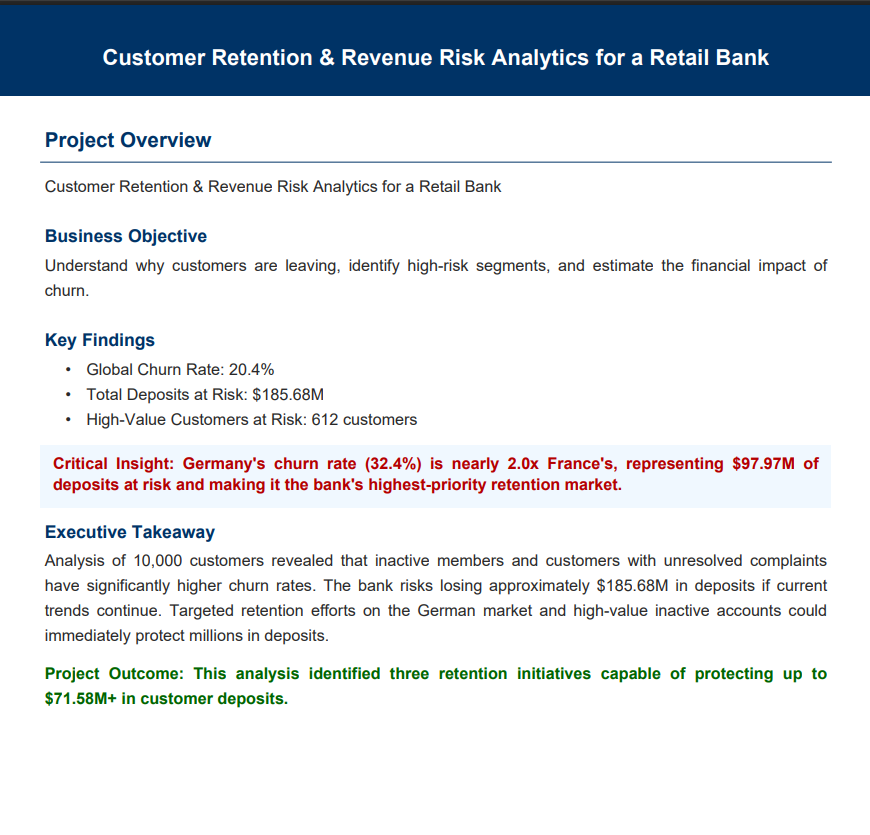
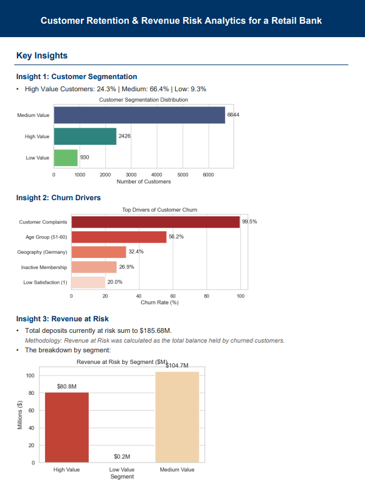
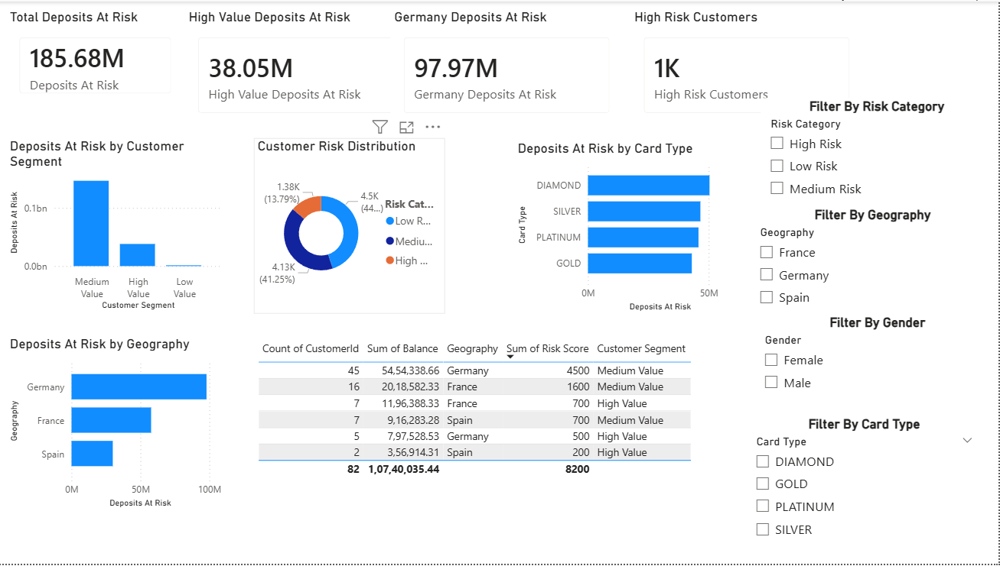

# Customer Retention & Revenue Risk Analytics for a Retail Bank

**SQL • Python • Power BI • Customer Analytics • Churn Analysis • Revenue Risk Assessment**

## Business Problem

Customer churn represents a major challenge for retail banks, leading to lost deposits, reduced customer lifetime value, and increased acquisition costs.

This project analyzes 10,000 banking customers to identify the primary drivers of churn, quantify revenue at risk, and recommend retention strategies that maximize business impact.

---

## Executive Summary

### Project Outcome

* Global Churn Rate: **20.4%**
* Deposits At Risk: **$185.68M**
* High-Value Customers At Risk: **612**
* Highest Risk Market: **Germany**
* Potential Deposits Protected: **$71.58M+**

### Executive Overview

Key findings showed that inactive customers, unresolved complaints, and customers located in Germany exhibited significantly higher churn rates than the overall customer population.

---

## Key Insights

### Customer Segmentation

* High Value Customers: 24.3%
* Medium Value Customers: 66.4%
* Low Value Customers: 9.3%

### Top Churn Drivers

1. Customer Complaints
2. Age Group (51–60)
3. Geography (Germany)
4. Inactive Membership
5. Low Satisfaction Score

### Revenue Risk

Revenue at Risk was calculated as the total balance held by churned customers.

* Total Deposits At Risk: $185.68M
* High Value Deposits At Risk: $80.8M
* Germany Deposits At Risk: $97.97M

---

## Dashboard

### Revenue Risk & Retention Strategy Dashboard

This dashboard was designed for business stakeholders to prioritize retention initiatives based on financial impact.

### Recommended Actions

| Priority | Action                               | Expected Impact   |
| -------- | ------------------------------------ | ----------------- |
| High     | Retain inactive high-value customers | Protect $5.15M    |
| High     | Improve complaint resolution         | Protect $37.04M   |
| Medium   | Focus Germany retention campaign     | Protect $29.39M   |
| Medium   | Loyalty program for new customers    | Improve retention |

---

## SQL Analysis

Key analyses performed:

* Customer Segmentation using CASE statements
* Revenue-at-Risk calculations
* Churn Analysis by Geography
* Customer Risk Identification
* Churn Driver Analysis

Advanced SQL concepts used:

* CTEs
* Window Functions
* Aggregate Functions
* CASE Statements

---

## Python Analysis

Performed:

* Data Cleaning
* Exploratory Data Analysis
* Customer Segmentation
* Churn Driver Investigation
* Revenue Risk Assessment

### Key Findings

* Customers with complaints exhibited the highest churn propensity.
* Inactive members were significantly more likely to churn.
* Customers aged 51–60 had the highest churn rate.
* Germany represented the largest concentration of deposits at risk.

---

## Tools Used

| Tool       | Purpose                  |
| ---------- | ------------------------ |
| SQL        | Data Analysis            |
| Python     | Data Cleaning & EDA      |
| Pandas     | Data Manipulation        |
| Matplotlib | Visualization            |
| Power BI   | Interactive Dashboarding |

---

## Project Deliverables

* Power BI Dashboard
* SQL Analysis Scripts
* Python Analysis Notebook
* Executive Summary Report

---

## Conclusion

The analysis identified three high-impact retention initiatives capable of protecting more than $71.58M in customer deposits. By focusing on complaint resolution, high-value inactive customers, and high-risk geographies, the bank can significantly reduce churn and improve customer retention.
